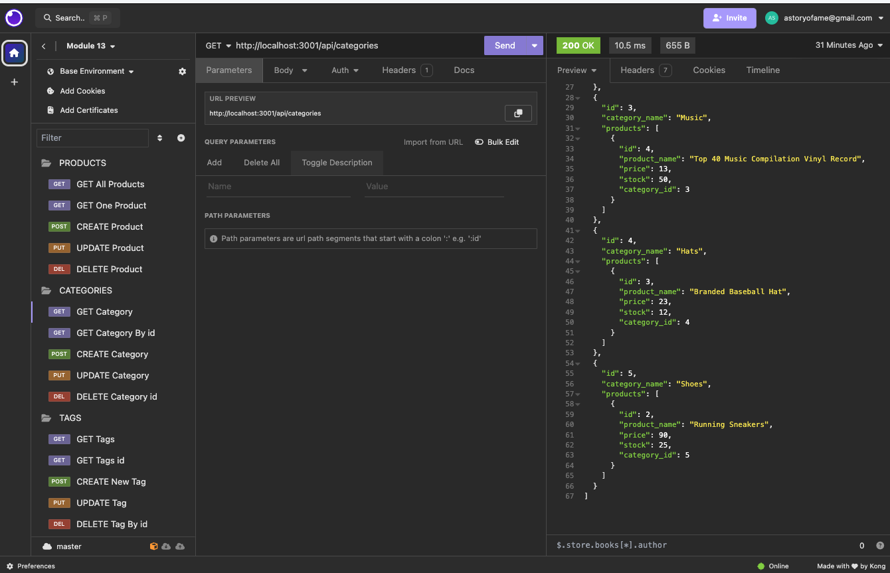

# ORM - E-Commerce-Back-End

## Description 

This application is the back end of an E-Ccommerce that utilizes Sequelize for Object-Relational Mapping (ORM). This application supports CRUD operations (Create, Read, Update, Delete) for Products, Categories, and Tags, using served based programs such as ThunderClient or Insomina. Users have the ability to GET data individually, or all at once. The data will include id's from Products, Categories, or Tags (models in the server). The application also has the ability to DELETE and POST data to the models within the server.
 

# Table of Contents
- [Installation](#installation)
- [Screenshot](#screenshot)
- [Video-Demo](#video-demo)
- [Questions](#questions)
- [License](#license)

## Installation
**Requirements to use application: <a href="https://dev.mysql.com/downloads/installer/">MySQL</a>, <a href="https://www.npmjs.com/package/dotenv/
">dotenv</a>, <a href="https://nodejs.org/en/">NodeJs</a> and <a href="https://insomnia.rest/download">Instomina</a>(or another preferred server testing program of your choice)</a>.**

To use this application, one must first clone the repository from GitHub into their coding software. Once this is done, follow the commands/instructions:

Opening the terminal command window on the root server.js file:

1- `npm install dotenv`

2- `npm install express`

This will install all the dependencies listed in for project's package.json file as well as dotenv.

Create a .env file in your repository using the code snippet below and enter your MySQL information.

`DB_NAME='ecommerce_db'`

`DB_USER=''`

`DB_PASSWORD=''`

Once the necessary packages are installed, add the seeds to your repo:

`npm run seed`

Now you are ready to start the application by opening the command terminal on
the root server.js file and run:

`node server.js` 

If you have nodemon installed, run:

`nodemon server.js`

If you wish to use Nodemon (optional), follow the instructions <a href="https://www.npmjs.com/package/nodemon">here</a>.

## Screenshot

## Video-Demo
[Video Demo](https://drive.google.com/file/d/1tpNRx7WBkEYFBsikeBGEE9n4nBfC7pyY/view?usp=drive_link)

## Features
<a href="https://expressjs.com/">ExpressJs</a>

<a href="https://nodejs.org/docs/latest/api/
">NodeJs</a>

<a href="https://www.npmjs.com/package/nodemon">Nodemon npm</a>

## Questions

<a href="https://github.com/tamerbekir">My GitHub</a>

If you have any questions or inquiries, feel free to contact me using my <a href="mailto:tamerbekir@yahoo.com">tamerbekir@yahoo.com</a>

This <a href="https://github.com/Tamerbekir/tamer-readme-generator">README.md</a> was generated by <a href="https://github.com/Tamerbekir">Tamer Bekir</a> using Node.js.

## License

This project is covered under the [MIT License](https://opensource.org/blog/license/mit) License
